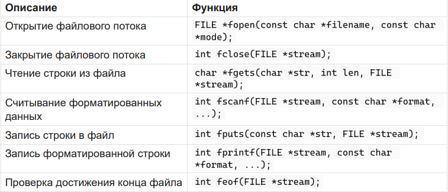
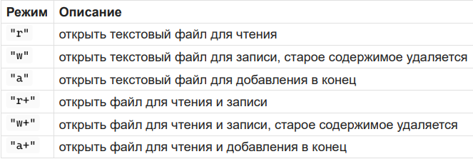

# 16. Текстовые файлы. Функции для работы с текстовыми файлами. Алгоритмы работы с текстовыми файлами.

Текстовые файлы - файлы, содержащие текстовые данные, организованные в виде строк.

Функции:



Режимы открытия файла



Пример чтения строк из файла

```c
FILE *file = fopen("input.txt", "r");
if (file != NULL) {
char str[100];
while (fgets(str, 100, file) != NULL) {
printf("%s", str);
}
fclose(file);
}
```

Пример записи в файл:

```c
FILE *file = fopen("output.txt", "w");
if (file != NULL) {
fprintf(file, "Number: %d\n", 10);
fputs("Hello\n", file);
fclose(file);
}
```

Алгоритм работы:<br>1. Открыть файл<br>2. Сделать проверку, открылся ли файл<br>3. Записать/считать данные из файла<br>4. Закрыть файл<br>Сортировка/удаление:<br>1. Открыть файл на чтение<br>2. Проверить на открытие<br>3. Считать значения из файла в массив<br>4. Отсортировать массив/удалить элемент из массива<br>5. Открыть файл на запись (он очистится)<br>6. Записать измененный массив в файл
