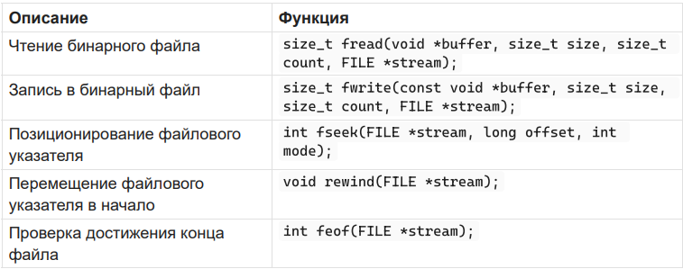
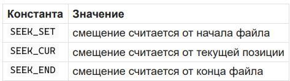
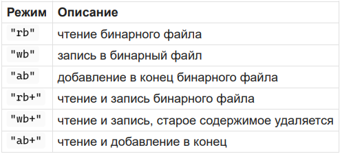

# 17. Бинарные файлы. Функции для работы с бинарными файлами. Алгоритмы работы с бинарными файлами.

Бинарные файлы - файлы, данные в котором записаны как последовательность произвольных байтов.



## Константы для fseek



## Режимы открытия бинарного файла



Пример записи в бинарный файл:

```c
int arr[] = {1, 2, 3, 4, 5};
FILE *file = fopen("data.bin", "wb");
if (file != NULL) {
fwrite(arr, sizeof(int), 5, file);
fclose(file);
}
```

Пример чтения из бинарного файла:

```c
int arr[5];
FILE *file = fopen("data.bin", "rb");
if (file != NULL) {
fread(arr, sizeof(int), 5, file);
fclose(file);
}
```

Алгоритм работы одинаковый с текстовым файлом: открыть, проверить, считать/записать, закрыть. Но для бинарных файлов используются режимы с b и функции fread/fwrite, потому что данные записываются не в текстовом виде, а в виде байтов памяти.
