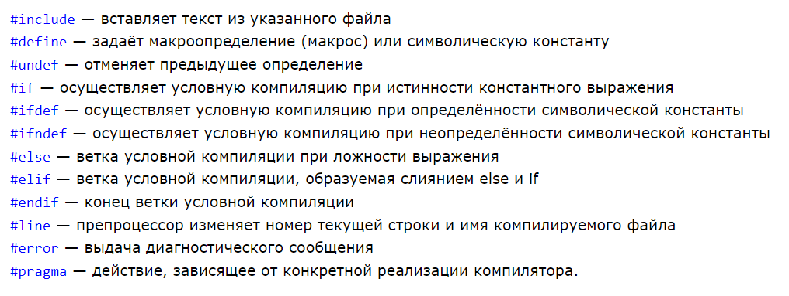

Командная строка препроцессора в языке C - это строка, которая начинается с символа # и обрабатывается до компиляции программы. Препроцессор выполняет предварительную обработку исходного кода: подключает файлы, заменяет макросы, исключает или включает части кода по условиям.

## Директивы препроцессора

Директивы препроцессора - инструкции выполняемые до компиляции программы. Позволяют изменить текст программы, например, заменить некоторые слова, добавить информацию из файла. Все директивы препроцессора начинаются со знака #. После директив препроцессора точка с запятой не ставятся



## Директива \#include

Директива \#include включает в текст программы содержимое указанного файла. Эта директива имеет две формы:#include "имя файла"#include \<имя файла>Если имя файла указано в кавычках, то поиск файла осуществляется в соответствии с заданным маршрутом или в текущем каталоге. Если имя файла задано в угловых скобках, то поиск файла производится в стандартных директориях операционной системы

## Директива \#define

Директива \#define служит для замены часто использующихся констант, ключевых слов, операторов или выражений некоторыми идентификаторами (макросами).Идентификаторы, заменяющие текстовые или числовые константы, называют именованными константами или объектными макросами.#define идентификатор текст#define TWO 2.Идентификаторы, заменяющие фрагменты программ, называют макроопределениями или функциональными макросами, причем они могут иметь аргументы.#define идентификатор(список параметров) текст#define SQUARE(X) X\*X.Эта директива заменяет все последующие вхождения идентификатора на текст. Такой процесс называется макроподстановкой или расширением. Текст может представлять собой любой фрагмент программы на СИ, а также может и отсутствовать. В последнем случае все экземпляры идентификатора удаляются из программы.

## Директивы \#ifdef (#else \#endif) \#ifndef

## Условная компиляция

Директивы \#if или \#ifdef \#ifndef вместе с директивами \#elif, \#else и \#endif управляют компиляцией частей исходного файла.

Если указанное выражение после \#if имеет ненулевое значение, в записи преобразования сохраняется группа строк, следующая сразу за директивой \#if. Синтаксис условной директивы следующий:

```c
#if константное выражение
  группа операций
#elif константное выражение
  группа операций
#else
  группа операций
#endif
```