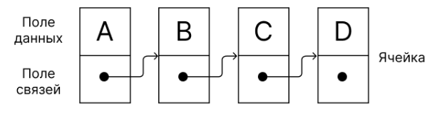
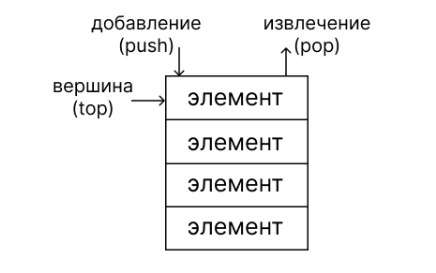
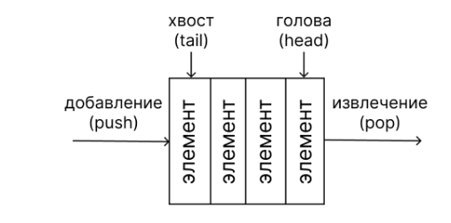

## Динамические структуры данных

Динамические структуры данных - это составные структуры данных, которые могут изменять свой размер во время выполнения программы.

В отличие от массива, динамические структуры не обязаны занимать одну непрерывную область памяти. Это удобно, потому что у массива есть недостатки:

-  размер часто фиксирован;
-  элементы расположены последовательно в памяти;
-  при вставке и удалении приходится сдвигать элементы;
-  возможен бесконтрольный доступ к памяти через указатели.

К динамическим структурам относятся: 
- односвязный список
- стек
- очередь

## Односвязный список

Односвязный линейный список - это динамическая структура данных, состоящая из узлов. Каждый узел хранит:

1. данные;
2. указатель на следующий узел.



```c
typedef struct Node { // узел односвязного списка
   void* data;
   struct Node* next;
} Node;
```

```c
typedef struct { // сам список
   Node* head;
   size_t size;
} List;
```

## Основные операции над односвязным списком

1. создание списка;
2. добавление элемента;
3. удаление узла;
4. удаление всего списка;
5. обход списка.

### Алгоритм добавления узла
Функция добавления узла принимает:

-  указатель на узел, после которого происходит добавление;
-  данные для нового узла.

Алгоритм добавления:

1. Создать новый узел.
2. Записать в него данные.
3. Установить указатель нового узла на следующий элемент.
4. Переставить указатель предыдущего узла на новый узел.

Пример:

```c
Node* newNode = malloc(sizeof(Node));
newNode->data = data;
newNode->next = prev->next;
prev->next = newNode;
```

Если вставка идёт в начало списка:
```c
newNode->next = list->head;
list->head = newNode;
```

### Алгоритм удаления узла

1. Проверить, что список не пустой.
2. Запомнить первый узел.
3. head переместить на следующий узел.
4. Освободить старый первый узел.

```c
void popFront(List* list, void* data) {
    Node* node = list->head;
    if (node) {
        memcpy(data, node->data, list->dataSize);
        list->head = node->next;
        free(node);
    }
}
```

## Полная реализация односвязного списка со всеми алгоритмами его обработки:
%% 1: че реально кто-то будет это учить? %%
%% 2: А есть другие варианты??? %%
%% 1: я о том, что вряд ли будут требовать реализацию алгоритмов обработки %%
%% 2: А мне кажется вполне, потому что это второй рк%%

```c
typedef struct Node {
    void* data;
    struct Node* next;
} Node;

typedef struct List {
    Node* head;
    size_t dataSize;
} List;

Node* createNode(const void* data, size_t dataSize) { // создание узла
    Node* node = malloc(sizeof(Node) + dataSize);
    node->data = (char*)node + sizeof(Node);
    node->next = NULL;
    memcpy(node->data, data, dataSize);
    return node;
}

List* createList(size_t dataSize) { // создание списка
    List* list = malloc(sizeof(List));
    list->head = NULL;
    list->dataSize = dataSize;
    return list;
}

void freeList(List* list) { // очищение списка
    Node* cur = list->head;
    while (cur) {
        Node* next = cur->next;
        free(cur);
        cur = next;
    }
    free(list);
}

// добавление элемента в начало
void pushFront(List* list, const void* data) {
    Node* node = createNode(data, list->dataSize);
    node->next = list->head;
    list->head = node;
}

// добавление элемента в конец
void pushBack(List* list, const void* data) {
    Node* node = createNode(data, list->dataSize);
    if (!list->head)
        list->head = node;
    else {
        Node* cur = list->head;
        while (cur->next)
            cur = cur->next;
        cur->next = node;
    }
}

// удаление элемента
void popFront(List* list, void* data) {
    Node* node = list->head;
    if (node) {
        memcpy(data, node->data, list->dataSize);
        list->head = node->next;
        free(node);
    }
}
```

## Стек



Стек - это динамическая структура данных, организованная по принципу: LIFO - Last In, First Out. То есть последний добавленный элемент извлекается первым.

Стек можно реализовать на основе односвязного списка.

## Основные операции стека(не из лекции)

1. push - добавить элемент в стек.
2. pop - извлечь верхний элемент.
3. top / peek - посмотреть верхний элемент без удаления.
4. isEmpty -проверить, пуст ли стек.

## Алгоритм добавления в стек

Добавление выполняется в начало списка:

```c
newNode->next = stack->top;
stack->top = newNode;
```

После этого новый элемент становится вершиной стека.

## Алгоритм извлечения из стека

Удаляется элемент с вершины:

```c
Node* deleted = stack->top;
stack->top = stack->top->next;
free(deleted);
```

То есть первым удаляется тот элемент, который был добавлен последним.

## Полная реализация стека:

```c
typedef struct Node {
    void* data;
    struct Node* next;
} Node;
typedef struct Stack {
    Node* top;
    size_t dataSize;
} Stack;

Node* createNode(const void* data, size_t dataSize) { // создание узла
    Node* node = malloc(sizeof(Node) + dataSize);
    node->data = (char*)node + sizeof(Node);
    node->next = NULL;
    memcpy(node->data, data, dataSize);
    return node;
}

Stack* createStack(size_t dataSize) { // создание стека 
    Stack* stack = malloc(sizeof(Stack));
    stack->top = NULL;
    stack->dataSize = dataSize;
    return stack;
}

void freeStack(Stack* stack) { // очистка стека
    Node* cur = stack->top;
    while (cur) {
        Node* next = cur->next;
        free(cur);
        cur = next;
    }
    stack->top = NULL;
    free(stack);
}

int isEmpty(Stack* stack) { // проверка стека
    return stack->top == NULL;
}

// добавление элемента в стек
void push(Stack* stack, const void* data) {
    Node* node = createNode(data, stack->dataSize);
    node->next = stack->top;
    stack->top = node;
}

// удаление элемента из стека, сам элемент переносится в переменную data
int pop(Stack* stack, void* data) {
    int result = !isEmpty(stack);
    if (result) {
        Node* node = stack->top;
        memcpy(data, node->data, stack->dataSize);
        stack->top = node->next;
        free(node);
    }
    return result;
}

// получение вершины в data
int peek(Stack* stack, void* data) {
    int result = !isEmpty(stack);
    if (result)
        memcpy(data, stack->top->data, stack->dataSize);
    return result;
}
```

## Очередь



Очередь - это динамическая структура данных, организованная по принципу: FIFO - First In, First Out. То есть первый добавленный элемент извлекается первым.

Пример структуры:

```c
typedef struct {
   Node* front;
   Node* back;
   size_t size;
} Queue;
```

## Алгоритм добавления в очередь

Новый элемент добавляется в конец:

```c
queue->back->next = newNode;
queue->back = newNode;
```

Если очередь была пустой:

```c
queue->front = newNode;
queue->back = newNode;
```

## Алгоритм извлечения из очереди

Удаляется первый элемент:

```c
Node* deleted = queue->front;
queue->front = queue->front->next;
free(deleted);
```

Если после удаления очередь стала пустой, нужно обнулить и конец очереди:

```c
queue->back = NULL;
```

## Полная реализация очереди:

```c
typedef struct Node {
    void* data;
    struct Node* next;
} Node;

typedef struct Queue {
    Node* head;
    Node* tail;
    size_t dataSize;
} Queue;

// создание узла
Node* createNode(const void* data, size_t dataSize) {
    Node* node = malloc(sizeof(Node) + dataSize);
    node->data = (char*)node + sizeof(Node);
    node->next = NULL;
    memcpy(node->data, data, dataSize);
    return node;
}

Queue* createQueue(size_t dataSize) { // создание очереди
    Queue* queue = malloc(sizeof(Queue));
    queue->head = NULL;
    queue->tail = NULL;
    queue->dataSize = dataSize;
    return queue;
}

int isEmpty(Queue* queue) { // проверка очереди
    return queue->head == NULL;
}

// добавление элемента в очередь
void push(Queue* queue, const void* data) {
    Node* node = createNode(data, queue->dataSize);
    if (isEmpty(queue)) {
        queue->head = node;
        queue->tail = node;
    } else {
        queue->tail->next = node;
        queue->tail = node;
    }
}

// удаление элемента из очереди, сами данные элемента переносятся в data
int pop(Queue* queue, void* data) {
    int result = !isEmpty(queue);
    if (result) {
        Node* node = queue->head;
        memcpy(data, node->data, queue->dataSize);
        queue->head = node->next;
        if (!queue->head)
            queue->tail = NULL;
        free(node);
    }
    return result;
}

void clearQueue(Queue* queue) { // очистка очереди
	Node* cur = queue->head;
	while (cur != NULL) {
	    Node* next = cur->next;
	    free(cur);
	    cur = next;
	}
    free(queue);
}
```