# 28. Динамические структуры данных. Графы. Виды графов (по типу рёбер, по числу рёбер, по достижимости узлов). Способы задания графов.

Граф как динамическая структура данных Граф - это структура данных, состоящая из множества вершин и множества ребер.

Формально граф записывается так: G = (V, E), где: V - множество вершин, E - множество рёбер

Вершины графа - элементы множества V. Рёбра графа - элементы множества E, которые соединяют вершины.

Графы применяются для описания связей между объектами. Области применения:

1. геолокация
2. компьютерные сети
3. планирование процессов
4. структура программы
5. химические соединения
6. связи между людьми

## Основные термины

1. Смежные вершины - это вершины, между которыми есть ребро. vi и vj смежны, если между ними есть связь
2. Путь - это последовательность рёбер, соединяющих вершины.
3. Простой путь - путь, в котором все вершины различны.
4. Длина пути - количество рёбер в пути.
5. Цикл - путь, в котором начальная и конечная вершины совпадают.
6. Петля - ребро, которое выходит из вершины и входит в неё же.
7. Дерево - это связный граф без циклов.
8. Взвешенный граф - граф, в котором каждому ребру приписан вес.

## Виды графов

## По типу рёбер

1. Ориентированный граф

Ориентированный граф - это граф, в котором рёбра имеют направление. Формально ребро задается как упорядоченная пара: (vi, vj). Это означает, что ребро идёт от vi к vj.

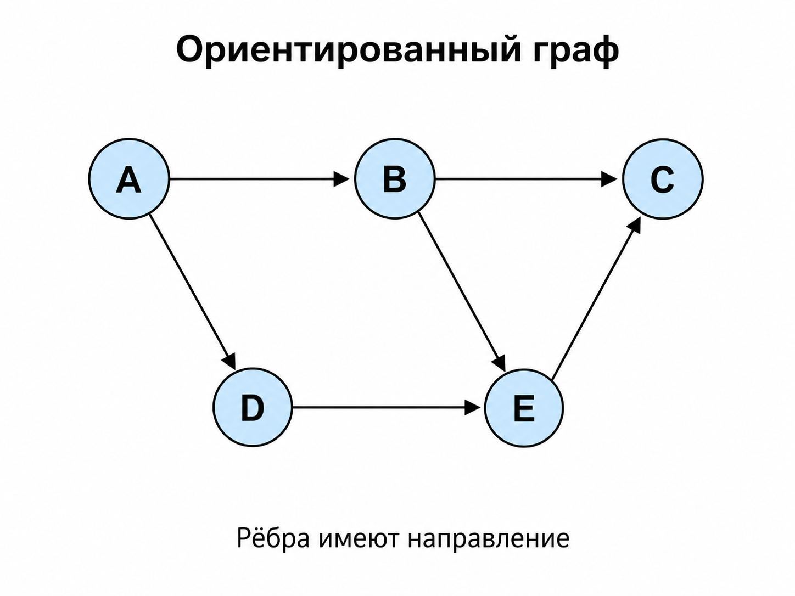

1. Неориентированный граф

Неориентированный граф - это граф, в котором рёбра не имеют направления. Ребро задаётся как неупорядоченная пара вершин.

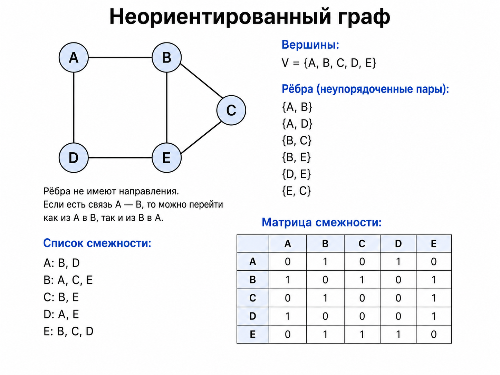

Взвешенный граф - граф, в котором каждому ребру приписан вес.

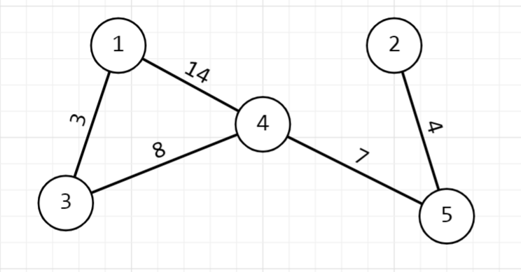

## По числу рёбер

1. Нулевой граф

Нулевой граф - граф, в котором нет рёбер. вершины есть, рёбер нет

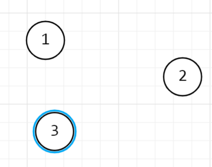

1. Неполный граф

Неполный граф - граф, в котором соединены не все возможные пары вершин.

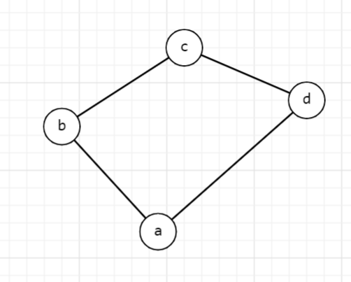

1. Полный граф

Полный граф - граф, в котором между каждой парой вершин есть ребро.

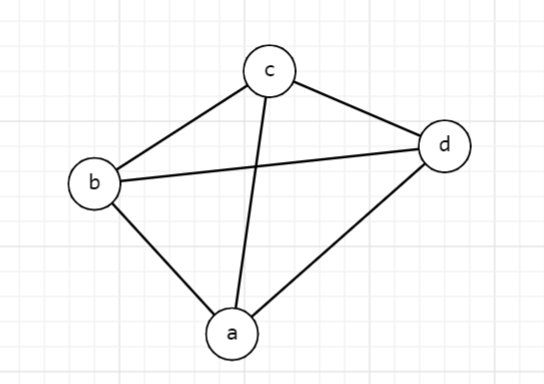

## По достижимости узлов

1. Связный граф

Связный граф - это граф, в котором между любой парой вершин существует путь. Из любой вершины можно попасть в любую другую.

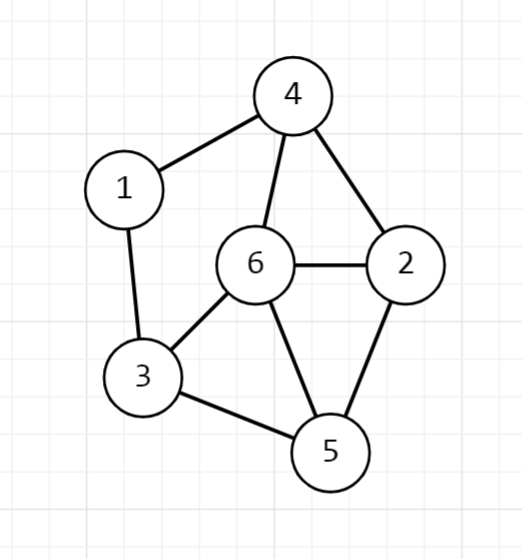

1. Несвязный граф

Несвязный граф - это граф, в котором есть хотя бы две вершины, между которыми не существует пути.

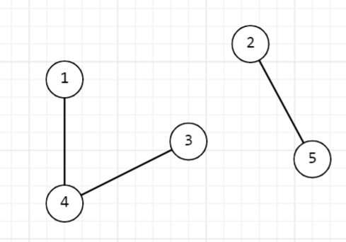

Компонента связности Связная компонента вершины v - это множество вершин неориентированного графа, до которых существует путь из вершины v. То есть если граф распадается на несколько отдельных частей, каждая такая часть называется компонентой связности.

## Для связных ориентированных графов

Для ориентированных графов дополнительно используют понятия:

1. сильно связный граф -  из любой вершины можно попасть в любую другую с учетом направления ребер.
2. слабо связный граф -  из любой вершины можно попасть в любую другую с учетом направления ребер.

## Способы задания графов

1) Матрица смежности Матрица смежности - это таблица, в которой строки и столбцы соответствуют вершинам графа. Если между вершинами есть ребро, в матрицу записывается 1, если ребра нет - 0.

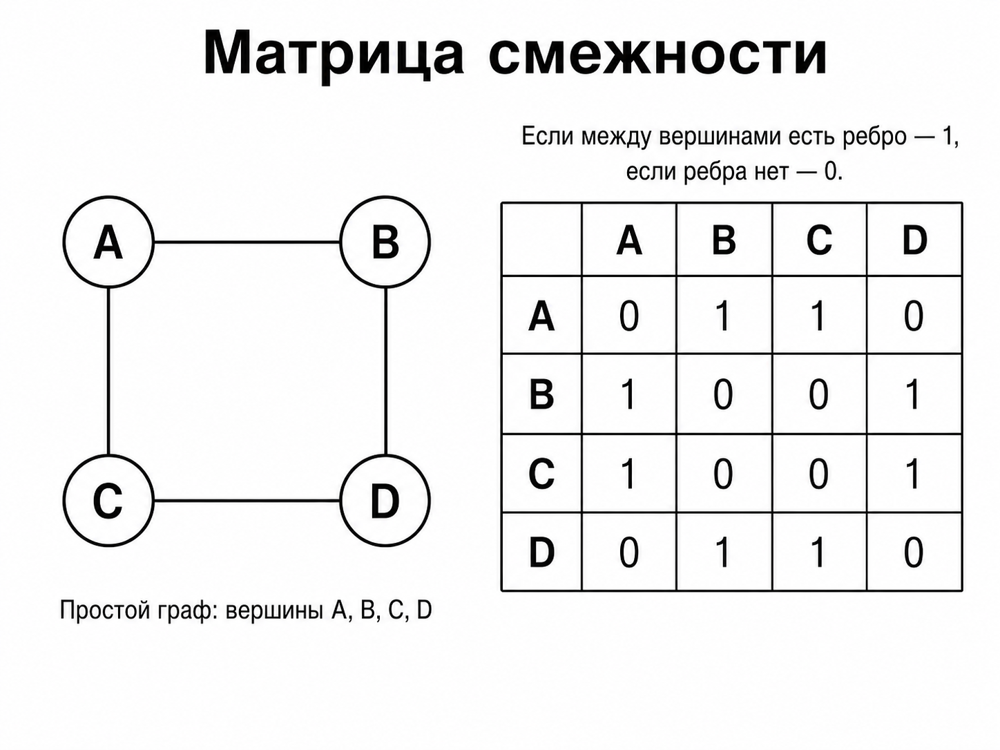

Для взвешенного графа вместо 1 можно записывать вес ребра.

Память: O(|V|^2)

Преимущество матрицы смежности - простой и быстрый доступ к информации о наличии ребра между двумя вершинами.

Недостаток - занимает много памяти, особенно если рёбер мало.

2) Списки смежности Список смежности - это способ задания графа, при котором для каждой вершины хранится список вершин, с которыми она соединена.

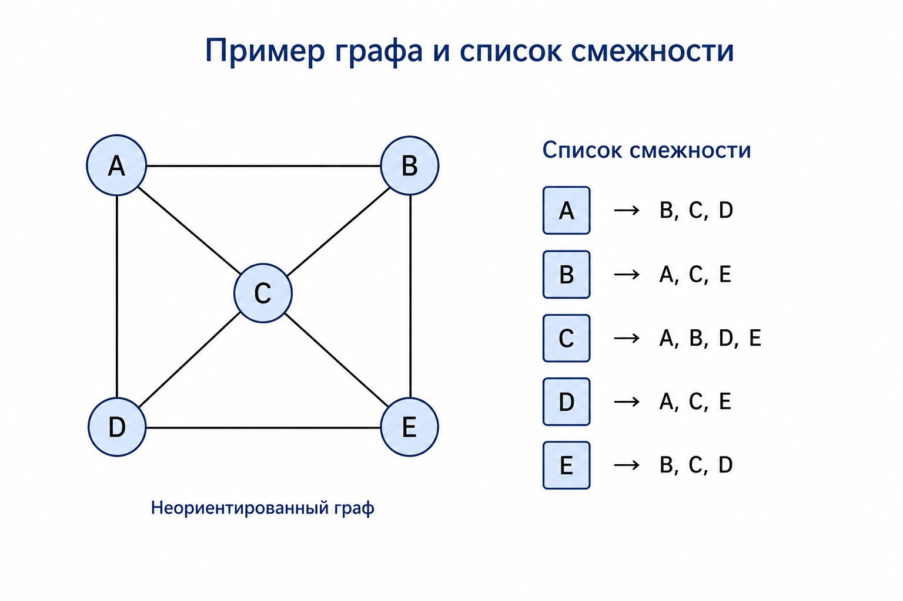

Память: O(|V| + |E|)

Списки смежности удобны для разреженных графов, где рёбер намного меньше, чем максимально возможно.

3) Множества смежности Способ представления графа через множества смежности, в том числе с весом.

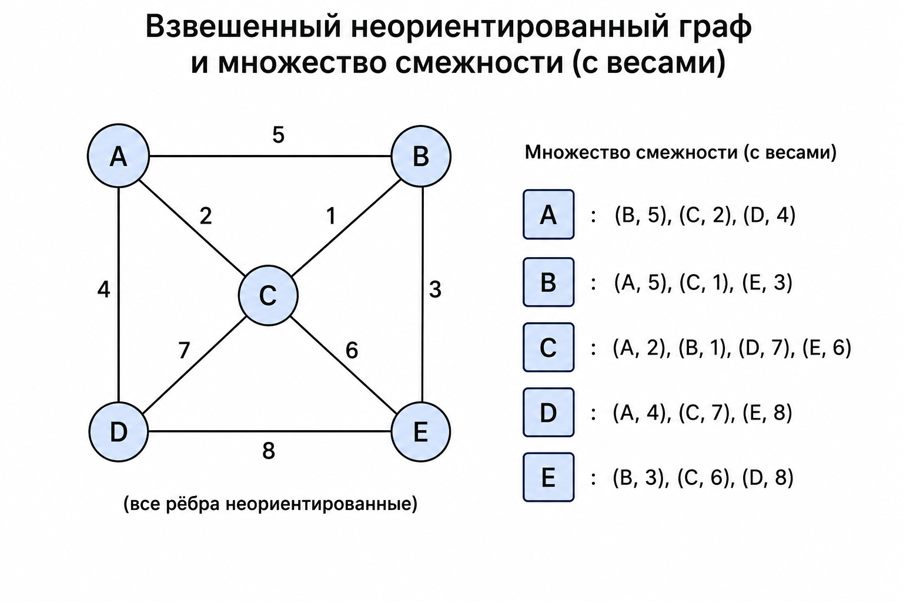

Здесь рядом с каждой соседней вершиной указывается вес ребра.