# 29. Динамические структуры данных. Графы. Алгоритмы обхода графа в ширину и глубину. Примеры.

Обход графа Граф - это структура данных, состоящая из вершин и рёбер. Обход графа - это процесс посещения его вершин в определённом порядке. Основные алгоритмы обхода:

1. BFS - поиск в ширину
2. DFS - поиск в глубину

Оба алгоритма обычно используют массив или множество visited, чтобы не обрабатывать одну и ту же вершину несколько раз.

Поиск в ширину - BFS Поиск в ширину от исходной вершины - это просмотр всех вершин графа в порядке возрастания расстояния от исходной вершины.

То есть сначала обрабатывается начальная вершина, потом все её соседи, потом соседи соседей и так далее.

BFS реализуется на основе очереди. Очередь работает по принципу: FIFO - First In, First Out. То есть вершина, которая была добавлена первой, будет обработана первой.

## Обход графа. Поиск в ширину(BFS)

Поиск в ширину от исходной вершины - просмотр всех вершин графа в порядке возрастания расстояния от исходной вершины. Алгоритм работает следующим образом:

1. Начните с размещения любой вершины графа в конце очереди.
2. Возьмите передний элемент очереди и добавьте его в список посещенных.
3. Создайте список смежных узлов этой вершины. Добавьте те, которых нет в списке посещенных, в конец очереди.
4. Продолжайте повторять шаги 2 и 3, пока очередь не опустеет.

Пример BFS:

1. Давайте посмотрим, как алгоритм «поиска в ширину» работает на примере. Мы используем неориентированный граф с 5 вершинами.

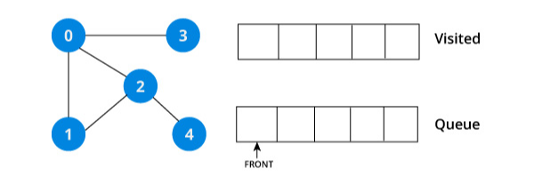

2. Мы начнем с вершины 0, алгоритм BFS начинается с помещения его в список посещенных и размещения всех смежных вершин в стеке.

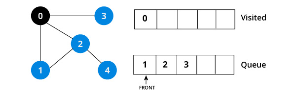

3. Затем мы посещаем элемент в начале очереди, то есть 1, и переходим к соседним узлам. Так как 0 уже был посещен, мы посещаем 2.

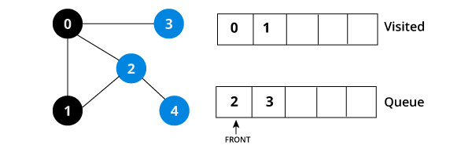

4. У вершины 2 есть соседняя не посещенная вершина 4, поэтому мы добавляем ее в конец очереди и посещаем 3, которая находится в начале очереди.

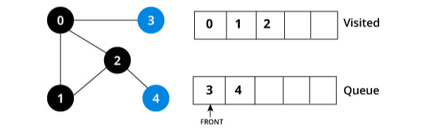

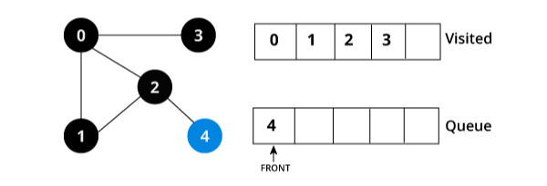

5. В очереди остается только 4, поскольку единственный соседний узел с 3, то есть 0, уже посещен. Мы посещаем вершину 4

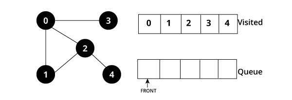

6. Поскольку очередь пуста, мы завершили обход в ширину графика.

## Особенности BFS

1. каждая вершина обрабатывается не более одного раза
2. легко найти кратчайший путь
3. легко найти обратный путь
4. реализуется на основе очереди
5. Сложность алгоритма: О(|V|+|E|)

Мой ответ: BFS находит кратчайший путь в невзвешенном графе, потому что посещает вершины в порядке увеличения расстояния от начальной вершины.

Для реализации на Си смотрите [Поиск в ширину (Breadth first search, BFS)](https://evileg.com/ru/post/512/)

Поиск в глубину - DFS  Поиск в глубину от исходной вершины - это продвижение в глубину графа до тех пор, пока это возможно.

Алгоритм выбирает соседнюю вершину, затем следующую соседнюю вершину, и так идёт дальше. Возврат назад происходит только тогда, когда из текущей вершины больше нельзя перейти в непосещённую вершину.

DFS реализуется на основе стека.Стек работает по принципу: LIFO - Last In, First Out. То есть последняя добавленная вершина обрабатывается первой.

DFS можно реализовать рекурсивно или через стек.

Список смежности - это один из способов представления графа:

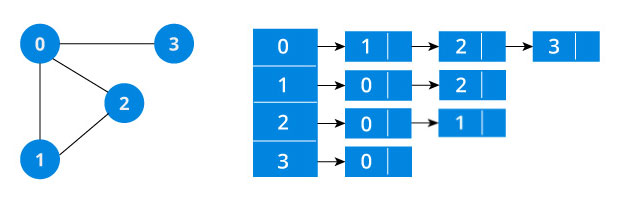

Для каждой вершины (первый столбик) мы составляем список смежных ей вершин, то есть список вершин с которыми у данной есть общие ребра(ребро инцидентное данным вершинам).

## Алгоритм поиска

1. Начнем мы с вершины “0”. В первую очередь алгоритм поиска в глубину поместит ее саму в список “Пройденные” (на изображении “Visited”), а ее смежные вершины - в стек.

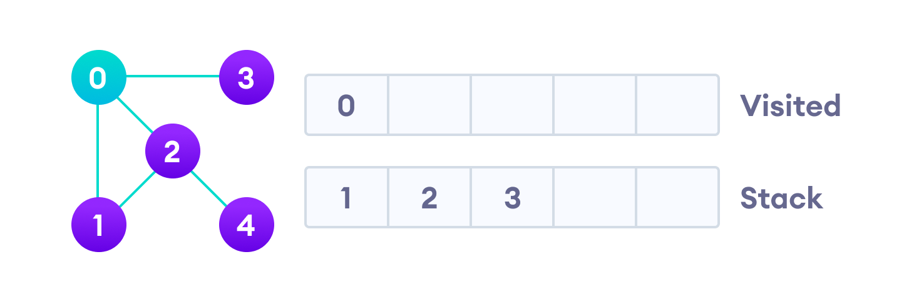

2. Затем мы берем следующий элемент сверху стека, т.е. к вершину “1”, и переходим к ее соседним вершинам. Поскольку вершина “0” уже пройдена, следующая вершина “2”.

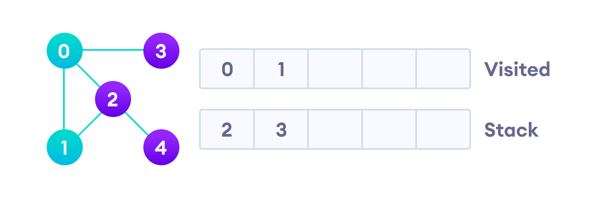

3. Вершина “2” смежна непройденной вершине “4”, следовательно мы добавляем ее наверх стека и проходим ее.

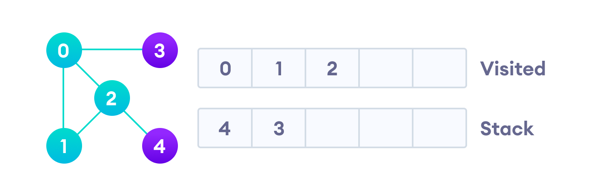

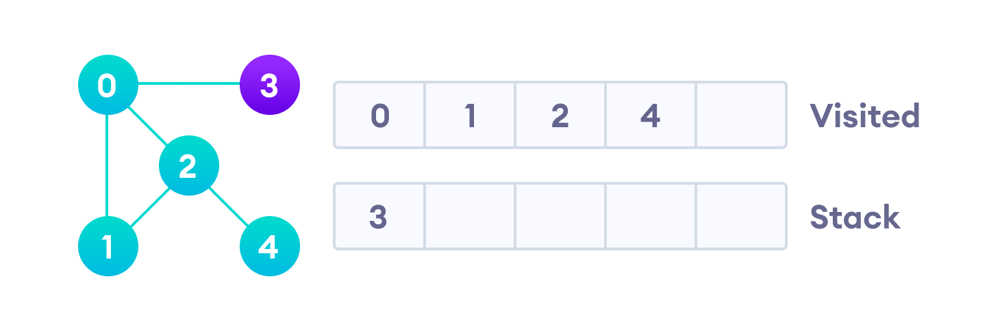

4. После того, как мы пройдем последний элемент (вершину “3”), в стеке не останется непройденных смежных вершин, и таким образом мы завершили обход графа в глубину.

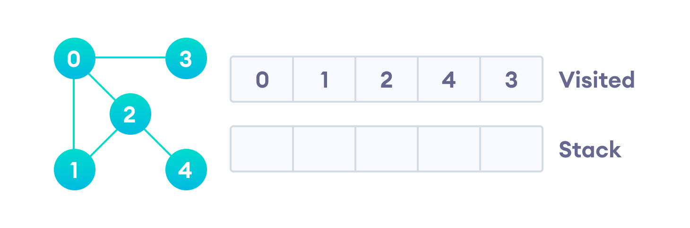

## Особенности DFS

1. каждая вершина обрабатывается не более одного раза
2. часто используется в задачах топологической сортировки
3. реализуется на основе стека

DFS также используют для поиска компонент связности, проверки циклов и анализа структуры графа.

Реализован только сам алгоритм, полный код [Реализуем алгоритм поиска в глубину / Хабр](https://habr.com/ru/companies/otus/articles/660725/)

## Сравнение BFS и DFS

BFS - идёт по уровням, использует очередь.

DFS - идёт в глубину, использует стек.