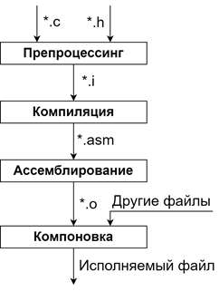

# 3. Этапы получения исполняемого файла из исходного кода, назначение каждого этапа, входные и выходные данные на каждом этапе.

1. Стадия препроцессинга ( \*.с + \*.h -\> \*.i) - подготовка кода к компиляции. Подстановка \#define, \#include добавляет содержимое заголовочных файлов, удаление комментариев
2. Стадия компиляции (\*.i -\> \*.asm) файл .i преобразуется в ассемблерный код (доступное для понимания человеком представление машинного кода)
   - 2.1 Лексический анализ - rerurn, printtf и т.п.
   - 2.2 Синтаксический анализ - закрыты ли ;
   - 2.3 Семантический анализ - совпадение типов данных
   - 2.4 Оптимизация и упрощение кода(в некоторых компиляторах)
3. Стадия ассемблирования (\*.asm -\> \*.o) файл .asm преобразуется в машинный объектный код.
4. Стадия компоновки/линковки (\*.o -\> исполняемый файл) связывает все объектные файлы .o в единый исполняемый. Линковка (компоновка) - последний этап сборки. Все что происходит на этом этапе подчиняется linker скрипту.

Ближе к телу:

Когда Вы собираете Ваш проект, и хотите включить в него библиотеку(собранную Статически или Динамически .а или \* so) происходит связывание Id всего Вашего кода. Когда вы где-то пишите, что тут будет вызываться функция библиотеки А, компилятор оставляет там пометку (по сути обещание), что референс на данные call будет подставлен на этапе линковки. Далее ликовщик смотрит на флаги связывания SHARED или STATIC(что и отвечает за динамическую или статическую библиотеку) и ищет ее согласно стандартным путям и/или указанным Вами путям.

Статическая библиотека - (.а) собрана для непосредственного встраивания в Ваш исполняемый файл. Она просто будет помещена в соответствии с указанием linker'a. Тут будет статическая линковка.

Динамическая библиотека - (\*.so) - будет просто подключаться как link на референс и не попадет в Ваш бинарный файл. Будет лишь указание, где брать референс на тот или иной функционал. Тут будет динамическая линковка.

⭐Объектный файл - файл, переведенный на машинный язык

⭐Единица трансляции - подаваемый на вход компилятора исходный текст(с расширением .с)