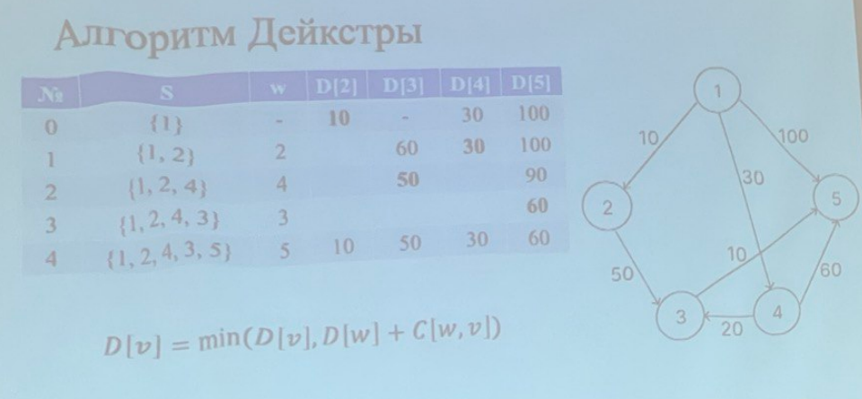

## Граф и задача кратчайшего пути

**Граф** - это структура данных, состоящая из вершин и рёбер: $G = (V, E)$, где $V$ - множество вершин, $E$ - множество рёбер.

Если рёбрам графа приписаны числовые значения, такой граф называется взвешенным графом. Эти значения называются **весами рёбер**.

Алгоритм Дейкстры используется для нахождения кратчайших расстояний от одной заданной вершины до всех остальных вершин во взвешенном графе.

**Важно**: алгоритм Дейкстры работает корректно, если веса рёбер неотрицательные.

## Идея алгоритма Дейкстры

Алгоритм постепенно находит минимальные расстояния от начальной вершины до остальных. Для каждой вершины хранится текущее известное расстояние от начальной вершины. Сначала:

1. расстояние до начальной вершины = 0
2. расстояния до всех остальных = бесконечность

Затем алгоритм выбирает непосещенные вершину с минимальным текущим расстоянием и обновляет расстояния до её соседей.

## Основные данные алгоритма

Используются:

1. `dist[]` - массив кратчайших расстояний
2. `visited[]` - массив посещённых вершин

Иногда также используют:

1. `parent[]` - массив предыдущих вершин для восстановления пути

## Алгоритм Дейкстры

1. Для начальной вершины установить расстояние 0.
2. Для всех остальных вершин установить расстояние ∞.
3. Все вершины пометить как непосещённые.
4. Среди непосещённых вершин выбрать вершину с минимальным текущим расстоянием.
5. Для всех соседей выбранной вершины выполнить проверку:
	если dist\[current\] + weight(current, neighbor) \< dist\[neighbor\], то обновить dist\[neighbor\]
	То есть: dist\[neighbor\] = dist\[current\] + weight(current, neighbor)
6. После обработки всех соседей текущая вершина помечается как посещённая.
7. Повторять шаги, пока не будут обработаны все вершины или пока не останется достижимых непосещённых вершин.

## Сложность алгоритма

Если граф хранится в виде матрицы смежности и каждый раз минимум ищется обычным перебором, сложность алгоритма: $O(V^2)$

Если используется список смежности и приоритетная очередь, сложность может быть: $O((V + E)* log V)$
%% картинка просто шик %%
%%так её ещё и использовать нельзя))%%
