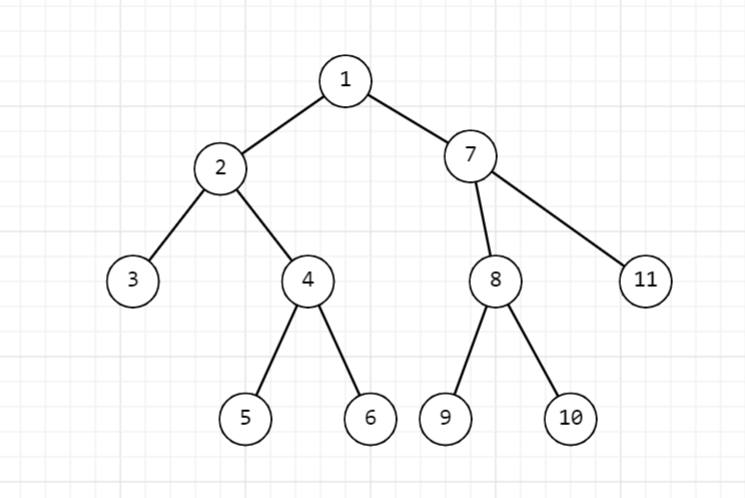
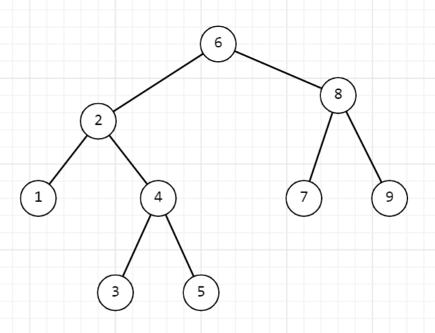
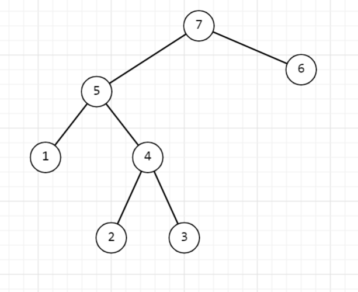

Дерево как динамическая структура данных\
Дерево - это связный ациклический граф. То есть дерево:

1. состоит из узлов и рёбер;

2. между любыми двумя узлами существует путь;

3. не содержит циклов.

Формально дерево можно рассматривать как граф: G = (V, E), где V - множество вершин, E - множество рёбер. Деревья относятся к динамическим структурам данных, потому что их можно реализовать через узлы и указатели, а количество узлов может изменяться во время выполнения программы.

## Основные понятия дерева

Корень - это узел, у которого нет родителя.

Лист - это узел, у которого нет детей.

Высота узла - это длина самого длинного пути от этого узла до какого-либо листа.

Глубина вершины или уровень вершины, - это длина пути от этой вершины до корневого узла.

Глубина дерева - это длина самого длинного пути от какого-либо листа до корня.

Бинарное дерево - это дерево, в котором у каждого узла существует не более двух детей.

Узел бинарного дерева можно описать так:

```c
typedef struct Node {
   int data;// значение узла
   struct Node* left;// указатель на левое поддерево
   struct Node* right;// указатель на правое поддерево
} Node;
```

Обход дерева - это посещение всех его узлов в определенном порядке.

Основные виды обхода:

1. обход в глубину

2. обход в ширину

Обход в глубину бывает:

1. pre-order  - прямой обход

2. in-order   - симметричный обход

3. post-order - обратный обход

## Обход в глубину: pre-order(прямой обход)

1. Посетить корневой узел

2. Обойти левое поддерево

3. Обойти правое поддерево



Реализация:

```c
void preorder(Node* root) {
   if (root == NULL)
       return;
```

```c
   printf("%d ", root->data);
   preorder(root->left);
   preorder(root->right);
}
```

## Обход в глубину: in-order(симметричный обход)

1. Обойти левое поддерево

2. Посетить корневой узел

3. Обойти правое поддерево



Реализация:

```c
void inorder(Node* root) {
   if (root == NULL)
       return;
```

```c
   inorder(root->left);
   printf("%d ", root->data);
   inorder(root->right);
```

}\
Примечание: Для бинарного дерева поиска in-order обход выводит элементы в отсортированном порядке.

## Обход в глубину: post-order(обратный обход)

1. Обойти левое поддерево

2. Обойти правое поддерево

3. Посетить корневой узел



Реализация:

```c
void postorder(Node* root) {
   if (root == NULL)
       return;
```

```c
   postorder(root->left);
   postorder(root->right);
   printf("%d ", root->data);
}
```

## Обход дерева в ширину

\
Обход дерева в ширину основан на использовании очереди.\
Примечание: При обходе в ширину узлы посещаются по уровням: сначала корень, затем его дети, затем дети его детей и так далее.

Очередь работает по принципу: FIFO - First In, First Out

Алгоритм:

1. Поместить корень в очередь.

2. Пока очередь не пуста:

-  извлечь первый элемент из очереди;

-  обработать его;

-  добавить в очередь его левого и правого потомков, если они есть.

Реализация:

```c
void bfs(Node* root) {
   if (root == NULL)
       return;
```

```c
   Queue q;
   initQueue(&q);
```

```c
   push(&q, root);
```

```c
   while (!isEmpty(&q)) {
       Node* current = pop(&q);
```

```c
       printf("%d ", current->data);
```

```c
       if (current->left != NULL)
           push(&q, current->left);
```

```c
       if (current->right != NULL)
           push(&q, current->right);
   }
}
```

Здесь Queue - очередь, которая хранит указатели на узлы дерева.