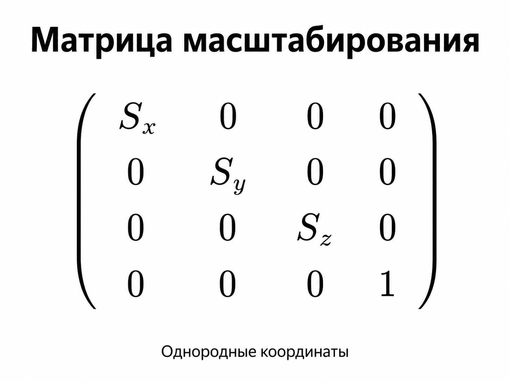
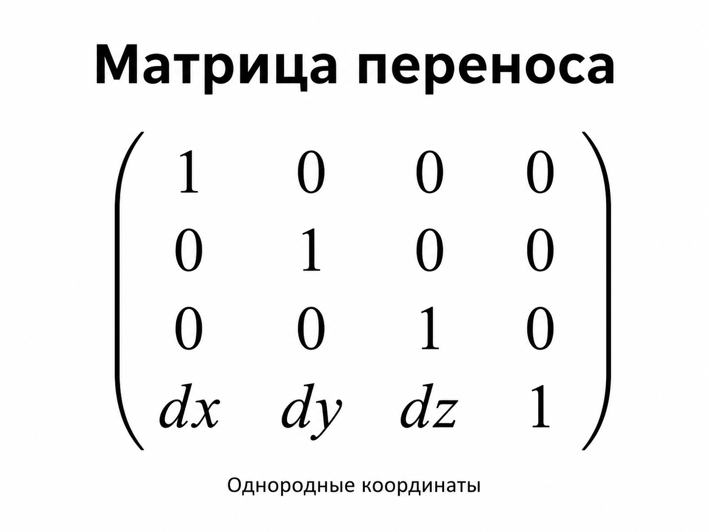
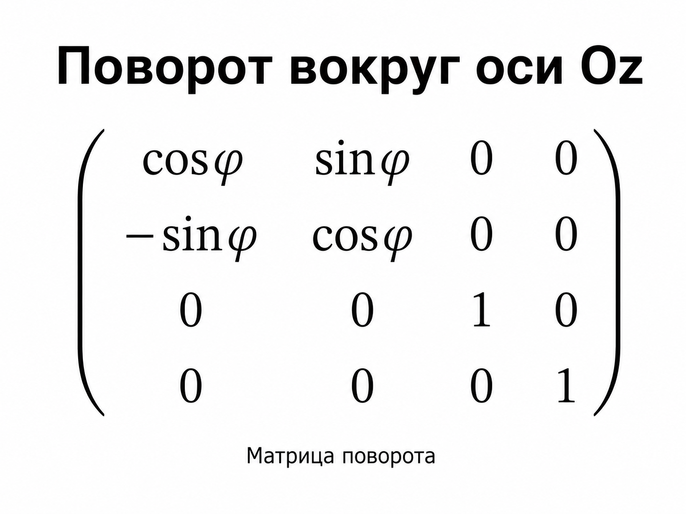
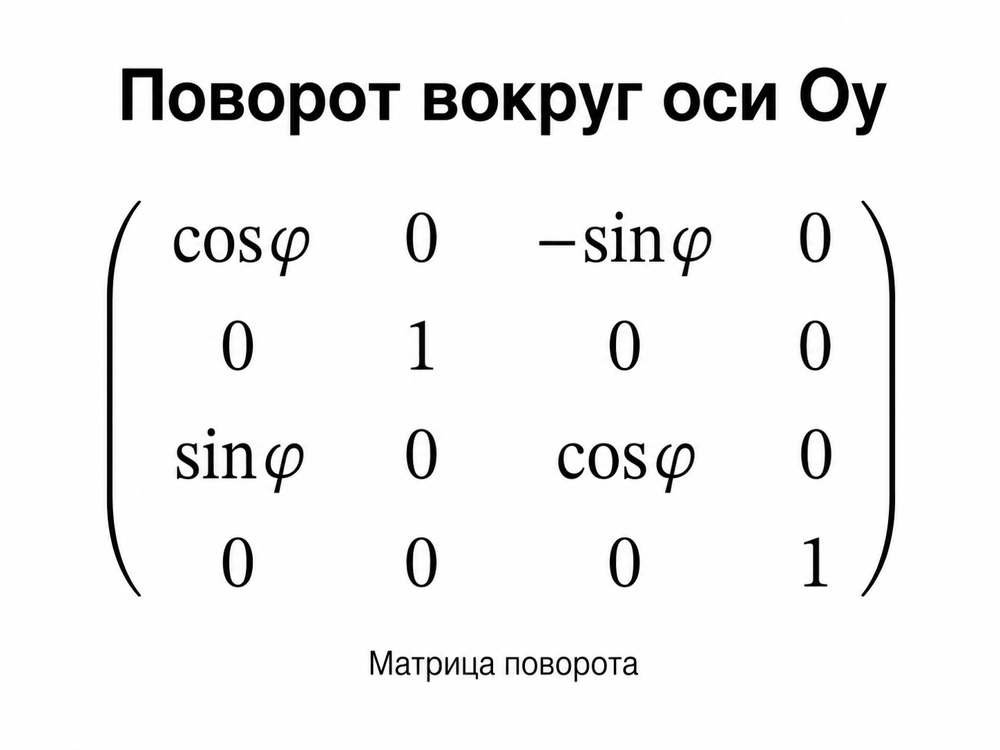
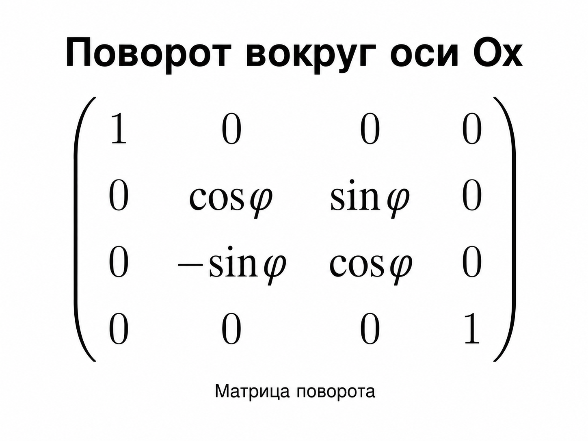

3D-модель - это математическое представление трёхмерного объекта.

Основные элементы 3D-модели:

1. вершина - точка с координатами (x, y, z);

2. ребро - отрезок, соединяющий две вершины.

Каркасная модель - это модель объекта, которая задаётся совокупностью вершин и рёбер. Она описывает форму многогранного объекта без закрашивания граней.

## Алгоритм рисования каркасной модели

Каркасная модель хранится как:

1. список вершин;

2. список рёбер.

Вершины задаются координатами: V1(x1, y1, z1), V2(x2, y2, z2), ...

Рёбра задаются парами номеров вершин: (V1, V2), (V2, V3), ...

Алгоритм рисования:

1. Задать координаты всех вершин модели.

2. Задать список рёбер, то есть какие вершины соединены.

3. Применить к вершинам нужные преобразования: масштабирование, перенос, поворот.

4. Выполнить проекцию 3D-точек на 2D-плоскость экрана.

5. Получить экранные координаты вершин.

6. Для каждого ребра нарисовать линию между двумя соответствующими вершинами.

То есть каркасная модель рисуется не гранями, а линиями между вершинами.

## Проекция 3D-модели

Чтобы вывести 3D-объект на экран, его нужно спроецировать на плоскость.

Основные типы проекций:

1. ортогональная проекция;

2. перспективная проекция.

Ортогональная проекция не учитывает расстояние до объекта. Если проекция идёт на координатную плоскость, одна из координат просто обнуляется.

Перспективная проекция учитывает дальность: более далёкие объекты выглядят меньше.

## Операции над 3D-моделью

Основные операции: перемещение, масштабирование, поворот относительно начала координат, поворот относительно другой точки.

Все эти операции применяются ко всем вершинам модели.Каждая вершина умножается на матрицу преобразования.

## 1\. Масштабирование

Масштабирование изменяет размеры модели по осям.

Для точки: M(x, y, z)

после масштабирования получаем:

1. x' = Sx \* x

2. y' = Sy \* y

3. z' = Sz \* z

где:

Sx - коэффициент масштабирования по оси Ox;

Sy - коэффициент масштабирования по оси Oy;

Sz - коэффициент масштабирования по оси Oz.

Матрица масштабирования в однородных координатах:

Если коэффициенты больше 1, объект увеличивается.\
Если коэффициенты меньше 1, объект уменьшается.

## 2\. Перенос

Перенос перемещает модель на заданное расстояние по осям.

Для точки:M(x, y, z)

после переноса:

1. x' = x + dx

2. y' = y + dy

3. z' = z + dz

где:

dx - смещение по Ox;

dy - смещение по Oy;

dz - смещение по Oz.

Матрица переноса:

Операции перемещения между собой коммутируемые, то есть порядок нескольких переносов не влияет на итоговый результат.

## 3\. Поворот

Поворот изменяет положение модели относительно оси или точки. В лекциях указаны матрицы поворота относительно трёх координатных осей.

## Поворот относительно оси Oz

Формулы:

1. x' = x\*cosφ - y\*sinφ

2. y' = x\*sinφ + y\*cosφ

3. z' = z

## Поворот относительно оси Oy

Формулы:

1. x' = x\*cosφ + z\*sinφ

2. y' = y

3. z' = -x\*sinφ + z\*cosφ

## Поворот относительно оси Ox

Формулы:

1. x' = x

2. y' = y\*cosφ - z\*sinφ

3. z' = y\*sinφ + z\*cosφ

## Поворот относительно другой точки

Поворот относительно произвольной точки выполняется в три шага:

1. Переместить объект так, чтобы точка поворота попала в начало координат.

2. Выполнить поворот относительно начала координат.

3. Переместить объект обратно.

То есть базовые преобразования выполняются относительно начала своей системы координат.

## Важное свойство операций

Операции преобразования в общем случае некоммутативны:

1. масштабирование \* поворот ≠ поворот \* масштабирование

2. перенос \* поворот ≠ поворот \* перенос

То есть порядок применения операций важен.

Исключение: операции переноса между собой коммутируют.