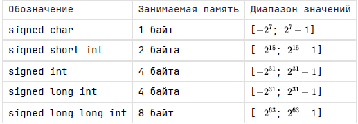
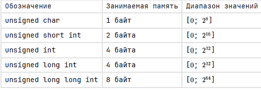
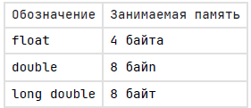

## Знаковые целые:



## Беззнаковые целые типы данных (неотрицательные):



## Вещественные типы данных:



Тип void не попадает под определение типа данных. Его используют только при возврате функции или при работе с указателями (`void*` - универсальный (пустой) указатель, используется, когда тип переменной неизвестен)

## Относительный размер целых типов данных:

```
sizeof(char) <= sizeof(short) <= sizeof(int) <= sizeof(long) <= sizeof(long long)
```

## Операции

Различают унарные, бинарные и тернарные операторы.

-  Арифметические операции: +, -, \*, /, %, +=, -=, \*=, /=, %=
-  Операции сравнения: \<, >, \<=, >=, \==, !=
-  Логические операции: &&, ||, !
-  Побитовые операции: &, |, ^, &=, |=, ^=, \~
-  Операции побитового сдвига: \<\<, >>, \<\<=, >>=
-  Операции инкремент и декремент: ++, --
-  Тернарный оператор ? :

**Над вещественными данными недопустимы**: %, побитовые, побитовый сдвиг, логические

## Приведение типов данных

Приведение типов данных - преобразование из одного типа данных в другой.

#### Неявное приведение происходит:

-  В арифметических операциях, если один из операндов имеет один тип, а другой отличный;

```c
float a = 5.995; 
int b = 5; 
a = a + b; // b преобразуется в тип float
```

-  При присвоении;

```c
char c = 6; 
int d = c; //c преобразуется в тип int
```

- При передаче в качестве аргумента функции;
-  При возвращении из функции.

## Явное приведение 

Явное приведение явно приводит тип переменной.

```c
double a = 5.252; 
a = (int)a;
```